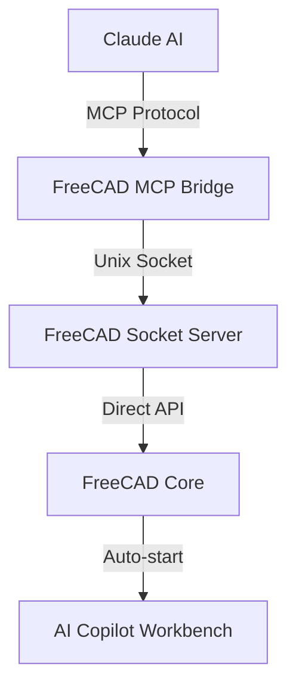

# FreeCAD MCP - AI-Powered CAD Automation

> **Create your FreeCAD models with Claude AI!**  
> FreeCAD MCP connects FreeCAD to Claude AI through the Model Context Protocol, enabling natural language control of professional CAD workflows.

[](https://www.gnu.org/licenses/old-licenses/lgpl-2.1.html)
[](https://www.python.org/downloads/)
[](https://freecad.org/)

## ✨ What is FreeCAD MCP?

FreeCAD MCP bridges the gap between AI assistants and professional CAD software. Through natural language commands, you can:

- **Create 3D models**: "Make a 50x30x20mm box with 3mm fillets"
- **Design parametric features**: "Add a 6mm counterbore hole at position (25, 0)"  
- **Automate CAD workflows**: "Create a linear pattern of 5 copies spaced 20mm apart"
- **Control FreeCAD entirely**: From sketching to advanced PartDesign operations

All through conversational AI - no need to remember complex CAD commands or menu locations.

## 🚀 Key Features

- **🤖 Natural Language CAD**: Control FreeCAD through conversational AI
- **🔧 Professional Operations**: 50+ CAD operations across 5 smart dispatchers
- **🎯 Production Ready**: Thoroughly tested parametric and Part workbench features
- **⚡ Real-time Communication**: Low-latency Unix socket connection
- **🏗️ Smart Architecture**: Auto-starts with FreeCAD, works from any workbench
- **📊 Interactive Selection**: Professional edge/face selection workflows
- **🐍 Python Integration**: Execute custom scripts for advanced operations

## 🏗️ How It Works



**Two-Component System:**
1. **FreeCAD AI Copilot Workbench**: Auto-starts with FreeCAD GUI, provides socket server
2. **MCP Bridge Server**: Python 3.11 server implementing Model Context Protocol

## 📋 Prerequisites

Before you begin, ensure you have:

- **FreeCAD 1.0+** (with Python 3.9+) - [Download FreeCAD](https://freecad.org/downloads.php)
- **Python 3.11+** - Required for MCP bridge server
- **Claude Desktop/CLI** or **Cursor** - Your AI assistant of choice

## 🛠️ Installation

### Step 1: Install Python Dependencies

```bash
# macOS (Homebrew)
brew install python@3.11

# Linux (Ubuntu/Debian)
sudo apt install python3.11 python3.11-venv python3.11-pip

# Windows - Download from python.org
```

Install MCP:
```bash
# macOS
/opt/homebrew/bin/python3.11 -m pip install mcp

# Linux/Windows  
python3.11 -m pip install mcp
```

### Step 2: Install Claude Desktop/CLI

Choose your preferred AI client:

**Claude Desktop:**
- Download from [Claude.ai](https://claude.ai/download)

**Claude CLI:**
```bash
# NPM (recommended)
npm install -g claude-code

# Homebrew (macOS)
brew install claude-code

# Verify installation
claude --version
```

### Step 3: Install FreeCAD AI Copilot Workbench

```bash
# Clone this repository
git clone https://github.com/contextform/freecad-mcp.git
cd freecad-mcp

# Install the workbench
# macOS
cp -r AICopilot ~/Library/Application\ Support/FreeCAD/Mod/

# Linux
cp -r AICopilot ~/.local/share/FreeCAD/Mod/

# Windows
cp -r AICopilot %APPDATA%\FreeCAD\Mod\
```

### Step 4: Configure MCP Server

**For Claude CLI:**
```bash
cd freecad-mcp

# Register MCP server
claude mcp add freecad /opt/homebrew/bin/python3.11 /full/path/to/freecad-mcp/working_bridge.py

# Verify registration
claude mcp list
```

**For Claude Desktop/Cursor:**
Add to your MCP configuration file:

```json
{
  "servers": {
    "freecad": {
      "command": "/opt/homebrew/bin/python3.11",
      "args": ["/full/path/to/freecad-mcp/working_bridge.py"]
    }
  }
}
```

## 🎯 Quick Start

### 1. Launch FreeCAD
Start FreeCAD - the AI Copilot service auto-starts:
```
🤖 Starting FreeCAD AI Copilot Service...
✅ AI Socket Server started - Claude Desktop ready
🎯 AI Copilot Service running - Available from ALL workbenches!
```

### 2. Connect Your AI Client
Open Claude Desktop/CLI in your project directory:
```bash
claude  # For CLI users
```

### 3. Verify Connection
Test the connection:
```
List available tools
```
You should see `mcp__freecad__*` tools available.

### 4. Start Creating!

**Basic 3D Objects:**
```
Create a cylinder with radius 15mm and height 40mm
```

**Parametric Features:**
```
Create a PartDesign pad from Sketch001 with 20mm length
Add a 3mm fillet to the edges of Pad001
```

**Advanced Operations:**
```
Create holes with 6mm diameter at positions (10,10) and (-10,-10)
Make a linear pattern of Feature001 with 5 copies spaced 25mm apart
```

## 🛠️ Available Operations

### 🎯 PartDesign Operations (13 Operations)
**Professional parametric CAD features - Tested & Production Ready:**

| Category | Operations | Description |
|----------|------------|-------------|
| **Additive (5)** | `pad`, `revolution`, `loft`, `sweep`, `additive_pipe` | Create material within PartDesign Body |
| **Subtractive (2)** | `groove`, `subtractive_sweep` | Remove material parametrically |
| **Dress-up (2)** | `fillet`, `chamfer` | Edge modifications with interactive selection |
| **Pattern (1)** | `mirror` | Feature mirroring |
| **Holes (3)** | `hole`, `counterbore`, `countersink` | Specialized hole features |

**Interactive Selection Workflow:**
```
Add a 3mm fillet to Pad001
# → FreeCAD opens for edge selection
# → Select edges, then continue in Claude
The fillet has been applied to the selected edges
```

### 🔧 Part Operations (18 Operations)
**Basic solids and boolean operations:**

- **Primitives (6):** Box, Cylinder, Sphere, Cone, Torus, Wedge
- **Booleans (4):** Fuse, Cut, Common, Section  
- **Transforms (4):** Move, Rotate, Scale, Mirror
- **Advanced (4):** Loft, Sweep, Extrude, Revolve

### 📷 View & Document Control (14 Operations)
**Complete FreeCAD control:**

- **View Management:** Screenshots, View angles, Zoom, Fit
- **Document Operations:** Save, List objects, Selection control
- **Object Management:** Hide/Show, Delete, Undo/Redo
- **Workbench Control:** Switch between workbenches

### 💪 Power User Features

**Execute Python in FreeCAD:**
```python
# Create complex parametric features
import FreeCAD
doc = FreeCAD.ActiveDocument
# Your custom FreeCAD Python code...
```

**Perfect for operations removed from MCP:**
- Draft angles, Thickness operations
- Complex patterns and arrays  
- Custom parametric features
- Advanced geometry creation

## 📖 Usage Examples

### Basic CAD Workflow
```bash
# Start with basic geometry
Create a 100x50x25mm box named "BaseBlock"

# Add parametric features  
Create a PartDesign pad from Sketch001 with 15mm length
Add a 2mm fillet to all edges of Pad001

# Create holes
Add a 6mm counterbore hole at position (30, 20) with 10mm depth

# Take documentation screenshot
Take a screenshot at 800x600 resolution from isometric view
```

### Advanced Parametric Design
```bash
# Complex PartDesign workflow
Create a revolution from ProfileSketch with 270° rotation
Add a groove from CutSketch with full 360° revolution  
Create a mirror of Groove001 across the YZ plane
Apply a 1.5mm chamfer to the top edges

# Use Python for complex operations
Execute this Python code to create a parametric thickness:
```python
# Select faces first, then create 2mm thickness
body = App.ActiveDocument.getObject("Body")
thickness = body.newObject("PartDesign::Thickness", "Thickness")
thickness.Base = (pad_object, selected_faces)
thickness.Value = 2.0
```

### Asset Integration
```bash
# Import and modify existing models  
Load a STEP file from /path/to/model.step
Add mounting holes with M6 threads at specified coordinates
Create assembly features for mating parts
```

## 🔧 Advanced Configuration

### MCP Server Options
Customize the bridge server behavior:

```python
# working_bridge.py configuration
SOCKET_PATH = "/tmp/freecad_mcp.sock"  # Custom socket path
TIMEOUT = 10  # Connection timeout
DEBUG_MODE = False  # Enable debug logging
```

### FreeCAD Integration
The AI Copilot workbench provides:

- **Service Management**: Start/stop AI services
- **Connection Status**: Monitor MCP bridge health  
- **Debug Tools**: Troubleshoot communication issues
- **Global Service**: Works from any FreeCAD workbench

## 🧪 Testing & Verification

**Comprehensive Testing Completed**: All 20+ PartDesign operations systematically tested.

### ✅ Verified Working (13 Operations)
- All additive and subtractive features
- Interactive dress-up operations (fillet, chamfer)
- Pattern and hole operations
- Professional parametric workflow

### 🐍 Python-Only Operations (7 Operations)
*Use `execute_python` for maximum flexibility:*
- Draft, Thickness (API complexity)
- Pocket, Subtractive Loft (stability issues)  
- Pattern operations (better Python control)

## 🚨 Security Notice

**Exercise caution when executing Python code in FreeCAD.** 

- Only run code from trusted sources
- Review Python scripts before execution
- FreeCAD has full system access through Python
- Use version control for important projects

## 🐛 Troubleshooting

### MCP Connection Issues
```bash
# Check server registration
claude mcp list

# Re-register if missing
claude mcp remove freecad
claude mcp add freecad /opt/homebrew/bin/python3.11 /path/to/working_bridge.py

# Restart Claude
exit && claude
```

### FreeCAD Socket Issues  
```bash
# Check socket exists
ls -la /tmp/freecad_mcp.sock

# Restart FreeCAD if missing
# Socket auto-creates on startup
```

### Tool Availability
```bash
# In Claude, verify tools loaded
List available tools

# Should show mcp__freecad__* tools
# If missing, check MCP server health
```

### Common Solutions
1. **Ensure FreeCAD 1.0+** with Python support
2. **Verify workbench installation** in correct Mod directory
3. **Check Python 3.11** for MCP bridge server
4. **Monitor FreeCAD console** for startup messages
5. **Restart both applications** if connection fails

## 🤝 Contributing

We welcome contributions! Areas for improvement:

- **New CAD Operations**: Add support for more FreeCAD features
- **Workbench Integration**: Sketcher, Draft, Arch workbenches
- **Performance**: Optimize socket communication
- **Documentation**: Usage examples and tutorials
- **Testing**: Expand automated testing coverage

### Development Setup
```bash
# Clone repository
git clone https://github.com/contextform/freecad-mcp.git
cd freecad-mcp

# Install development dependencies
python3.11 -m pip install -e .

# Run tests
python -m pytest tests/
```

## 📜 License

This project is licensed under **LGPL-2.1-or-later**, compatible with FreeCAD's license.

## 🔗 Links & Resources

- **[FreeCAD](https://freecad.org/)** - Open Source 3D CAD
- **[Claude AI](https://claude.ai/)** - AI Assistant Platform
- **[Model Context Protocol](https://modelcontextprotocol.io/)** - MCP Standard
- **[Claude Code CLI](https://github.com/anthropics/claude-code)** - Official CLI Tool

## 📞 Support

- **Issues**: [GitHub Issues](https://github.com/contextform/freecad-mcp/issues)
- **Discussions**: [GitHub Discussions](https://github.com/contextform/freecad-mcp/discussions)
- **Documentation**: [Project Wiki](https://github.com/contextform/freecad-mcp/wiki)

---

**🎯 Ready to revolutionize your CAD workflow with AI?**

Install FreeCAD MCP today and start creating with natural language!

*Built with ❤️ for the FreeCAD community by [ContextForm](https://contextform.com)*